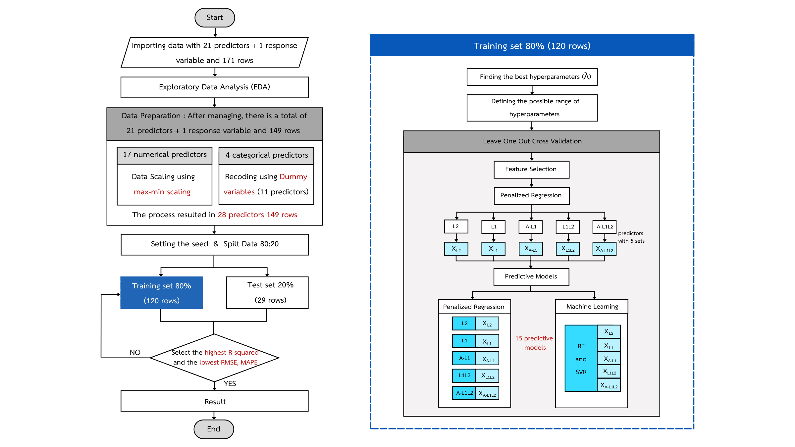

## Predictive Modeling of Dermatology Life Quality Index in Patients with Psoriasis

## Methodology

**1. Data Cleaning**  
Handling missing data revealed that 22 patients out of 171 total patients had missing data. The missing pattern was identified as Missing Completely At Random (MCAR), where the missing values were independent of other variables. Therefore, the decision was made to remove this portion of data, leaving a total of 149 patients. 
**2. Data Transformation**  
Patient data collection included 4 categorical variables, where similar values were grouped together and converted to numerical values using dummy variables. For the 17 numerical variables, values were adjusted using Max-Min Scaling to range from 0–1 to align with the dummy variables. In summary, this step resulted in 28 independent variables, 1 dependent variable, and a total of 149 patient records. 
**3. Data Splitting (Training and Testing set)**  
The data was split into 2 sets with an 80:20 ratio, where the training set contained 120 cases and the test set contained 29 cases. The test set will be used for final model performance evaluation, while the training set will be used for feature selection and predictive model development. 
**4. Feature Selection**  
Due to the increased number of variables from the Data Transformation step, it was necessary to select only the independent variables that are important for model building. Five types of penalized regression techniques were used: Ridge, LASSO, Adaptive LASSO, Elastic Net, and Adaptive Elastic Net. The optimal lambda (λ) parameter was tuned from a range of 0.001 to 1000, totaling 61 values. 
**5. Training Model**  
Penalized regression not only helps with feature selection but can also be used for prediction. Therefore, all 5 models were selected for modeling, with each model using its own selected set of independent variables. Additionally, 2 machine learning models were used: Random Forest and Support Vector Regression, which utilized all 5 sets of selected independent variables. 
**6. Hyperparameter Tuning**  
For optimal parameter tuning in machine learning, the GridSearchCV method was used. Hyperparameter values were defined and evaluated using Leave-One-Out Cross Validation, selecting the hyperparameter values that yielded the lowest RMSE to create the final predictive model.
The hyperparameter tuning for machine learning models used GridSearchCV by defining sets of hyperparameter values and evaluating them through Leave-One-Out Cross Validation, selecting values that produced the lowest RMSE for use in creating the final predictive model.

| Model                  | Parameter         | GridSearchCV Values                                      |
|------------------------|-------------------|-----------------------------------------------------------|
| **Random Forest**      | mtry              | Seq(2, min(ncol(train_data) - 1, 15), by = 1)             |
|                        | splitrule         | "extratrees", "variance"                                 |
|                        | min.node.size     | 5:20                                                      |
|                        | num.trees         | Seq(10, 300, 10)                                          |
| **Support Vector Regression** | C               | 0.001, 0.01, 0.1, 1, 10, 100                              |
|                        | sigma             | 0.0001, 0.001, 0.01, 0.1, 1, 2, 5                          |
|                        | epsilon           | 0.01, 0.05, 0.1, 0.5, 1                                   |

**7. Model Evaluation**  
In summary, this resulted in a total of 5 + (5×2) = 15 prediction models. Three criteria were used to compare prediction performance: RMSE, MAPE, and R-squared. The most effective predictive model is the one that produces the lowest RMSE and MAPE values, and the highest R-squared value. 

